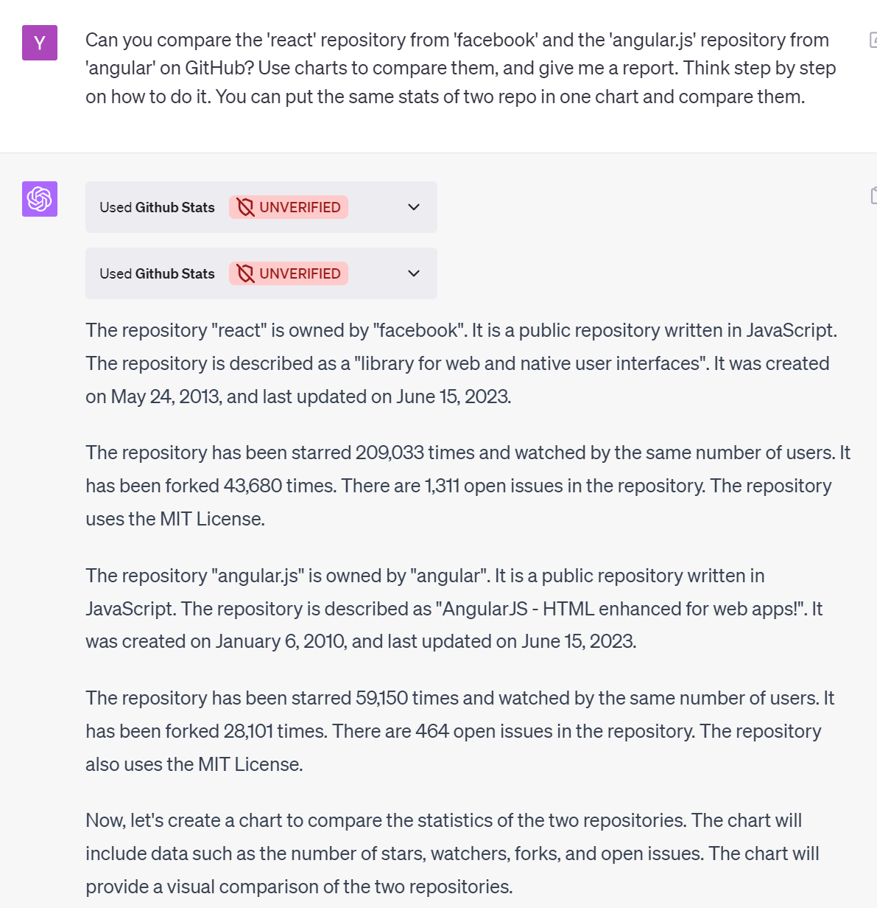

# ChatGPT GitHub Stat Plugin

[](https://github.com/yunwei37/ChatGPT-github-stat-plugin/actions/workflows/nextjs.yml)

A powerful GPT plugin designed to provide insights into GitHub repositories and users. Whether you're a developer looking for detailed statistics about a repository, or a project manager comparing the growth of different repositories, this plugin has got you covered.

## Features

- **Repository Insights**: Get detailed information about a specific GitHub repository, including the number of stars, forks, and issues, the primary language used, license, and more.
- **User Insights**: Learn about a specific GitHub user, such as the number of followers, repositories, contributions, total stars, pull requests, and more.
- **Repository Comparison**: Compare two repositories by asking for information about both repositories. Visualize the comparison using the charts plugin.
- **Growth Tracking**: Track the growth of a repository over time and visualize it using the charts plugin.
- **User Activity Analysis**: Analyze the activity of a GitHub user over time.

## Usage and Examples

Here are the same use cases expressed in more natural language:

1. **Getting information about a specific GitHub repository**

    You can ask for information about:

    - a specific GitHub repository, such as the number of stars, forks, and issues, the primary language used in the repository, license, etc.
    - the history of a specific GitHub repository, such as the number of stars over time.
    - the topic of repositories.
    - the README of a repository.

    For example:

    > Can you tell me the statistics for the https://github.com/Significant-Gravitas/Auto-GPT? Should I use it in my project? Tell me your analysis.

    

    You can ask questions about whether you should use a specific repository in your project, how to improve a specific repository as a maintainer, etc.

    You can easily get the charts of the history of a repository by using the charts plugin in ChatGPT:

    

2. **Getting information about a GitHub user**

    You can ask for information about:
    
    - a specific GitHub user, such as the number of followers, the number of repositories, the number of contributions, total stars, total pull requests, followers etc.
    - the ranks of a specific GitHub user, Available ranks are S+ (top 1%), S (top 25%), A++ (top 45%), A+ (top 60%), and B+ (everyone). The values are calculated by using the cumulative distribution function using commits, contributions, issues, stars, pull requests, followers, and owned repositories.
    
    For example:
    
    > Can you show me how the activity of the GitHub user 'torvalds'? Tell me about him now.

    

3. **Comparing two repositories**

    You can compare two repositories by asking for information about both repositories. What's more, you can use charts plugin in ChatGPT to visualize the comparison.

   > Can you compare the 'react' repository from 'facebook' and the 'angular.js' repository from 'angular' on GitHub? Use charts to compare them, and give me a report. Think step by step on how to do it. You can put the same stats of two repo in one chart and compare them.

   

   charts:

    

4. **Tracking the growth of a repository over time**

    You can easily track the growth of a repository over time and then using the charts plugin in ChatGPT to visualize the growth, with a single prompt.

    > Can you read the star history and stats of https://github.com/eunomia-bpf/wasm-bpf , analyze the result, and build charts for sthe starhistory(a linear representation of dates on a horizontal scale), and the statistics? Think step by step and choose the right ways.  To create a linear horizontal axis based on the provided dates, you can follow these steps:
    > 
    > Determine the range of dates: Identify the earliest and latest dates in the dataset.
    > Calculate the time span: Calculate the duration or time span between the earliest and latest dates. 
    > Determine the scale: Decide on an appropriate scale for the horizontal axis based on the time span. You can choose a suitable unit of measurement, such as days, and divide the horizontal space evenly based on the number of days in the time span.
    > Assign positions to the dates: Assign positions or coordinates on the horizontal axis to each date based on their relative distances from the starting point.

    

    and charts(plugin for this example: **Charts by Kesem AI**):

    

5. **Analyzing the activity of a user over time**

    > tell me about https://github.com/Himself65 and alalyze his repo, what does the activity of a him over time?

    

Share links:

- https://chat.openai.com/share/23ec1986-fd70-4768-80a3-3beb53e27a4a
- https://chat.openai.com/share/f96d1ba7-5275-44f1-bdda-7ea7294700a9

## Project setup

1. Run the server

    set the env `REACT_APP_GITHUB_ACCESS_TOKEN` as your github token and run the server:

    ```sh
    export REACT_APP_GITHUB_ACCESS_TOKEN=<your github token>
    npm run build
    npm start
    # If you run this in dev mode, the memory may not persist well as the server will randomly restart sometimes
    ```

2. Set up your GPT Plugin in the ChatGPT Plugin UI.

    When prompted for your website domain, type in 'https://chat-gpt-github-stat-plugin.vercel.app'

## License

This project is licensed under the MIT License - see the [LICENSE](LICENSE) file for details.

## Contributing

We welcome contributions from the community. If you'd like to contribute, please fork the repository and make changes as you'd like. Pull requests are warmly welcome.

## Support

If you encounter any issues or have questions, feel free to open an issue. We'll do our best to help.

